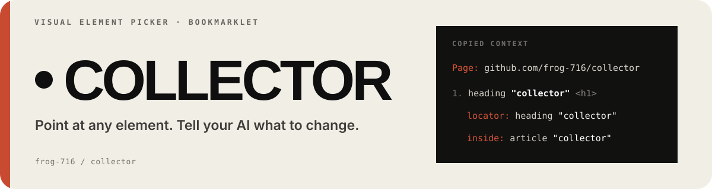

<p align="center">
  
</p>

**collector** is a bookmarklet for selecting web elements and copying structured context into Claude Code, Codex, Cursor, or any AI coding assistant.

Forked from [oil-oil/selector](https://github.com/oil-oil/selector) (MIT). Two things changed in this fork:

- Multi-select is bound to **⌘** (the macOS-native gesture) instead of Shift.
- A written plan for capturing the JS-driven animations the current build cannot see — see [docs/animation-roadmap.md](docs/animation-roadmap.md).

## Install

1. Visit the **[install page](https://frog-716.github.io/collector/)**
2. Drag the **collector** button to your bookmarks bar (one-time)
3. Done

The install page follows your browser language and includes an English / Chinese toggle.

## Usage

Open any web page, click the **collector** bookmark.

| Action | What it does |
|---|---|
| **Click** | Select an element |
| **⌘ + Click** (or **Shift + Click**) | Add to / remove from selection |
| **Drag** | Marquee select multiple elements |
| **⌘ + Drag** | Add the marquee area to the current selection instead of replacing it |
| **↑ / ↓** | Navigate to parent / child element |
| **← / →** | Navigate to previous / next sibling |
| **✎ button** | Add per-element instruction |
| **⌘C** | Copy prompt to clipboard |
| **⌘M** | Copy selected content as Markdown |
| **⌘⇧C** | Copy selected area screenshot |
| **⌘Z** | Undo last selection change |
| **F2** | Pause / resume element selection |
| **Esc** | Clear the current selection or close the current popover |

On Windows and Linux the shortcut hint in the panel still reads **Shift**, since ⌘ does not exist there.

One caveat on macOS: when you ⌘-click a real `<a href>` link, the browser opens it in a new tab. That is a browser-level behaviour a page script cannot cancel. On links, use **Shift + Click** instead.

Copied prompts include the element name, stable locator, semantic location, and React details, with CSS, layout, parent, or HTML context added only when useful. Long URLs are reduced to the route and key query values.

Enable **Sharingan mode** for higher-fidelity recreation. **⌘C** then captures document context, geometry, sanitized DOM, effective styles and states, fonts, animations, media, React details, and nearby context. Small reports go to the clipboard; large ones download as `.md` files.

With **Screenshot + text combined** enabled, **⌘C** copies the prompt and selected-area screenshot, downloads the PNG, and adds its local path to the prompt for text-only AI inputs.

## What it can and cannot capture

Worth knowing before you point it at a page:

- **CSS animations and transitions** — captured in full: `animation-*` / `transition-*` values, the `@keyframes` definitions themselves, `transform`, and SVG `<animate>` elements. Runtime state markers such as `data-step`, `aria-expanded` and `.is-active` are recorded too.
- **JS-driven animation** (GSAP, Lottie, Framer Motion, Three.js, anything drawn into a `<canvas>` or WebGL context) — **not** captured. You get a single frozen snapshot of the current frame, not the timeline. `canvas` is recorded only as its bitmap size plus a `2d`/`webgl` label.
- **Screenshots are single-frame.** There is no recording mode; the `frameRate: 1` in the capture path grabs one frame, it does not record.

Closing that second gap is the point of the roadmap.

## Example output

```
Page: https://example.com/dashboard?tab=overview

1. Hero "Welcome to the Dashboard" <h1>
   selector: [data-testid="hero-title"]
   locator: heading "Welcome to the Dashboard"
   source: src/components/Hero.tsx:12
   react: Layout › Hero
   instruction: Make this red and larger

2. nav "Home Settings Profile Logout" <nav>
   locator: nav "Home Settings Profile Logout"
   inside: main "Dashboard"
   instruction: Add an "Analytics" link after "Settings"
```

For long filtered pages, the copied prompt is shortened like this:

```
Page: http://localhost:3000/campaigns/2079fa76-9c77-4900-b11a-086f4464ff2b/settlement
Query: date_from=2026-05-23, date_to=2026-06-22, creator_ids ×2
```

## How it works

collector injects its compiled assets into the current page and runs entirely client-side — no data is sent anywhere. The build bundles the editor and Sharingan mode into the bookmark, so it works offline after installation.

## Development

```bash
git clone https://github.com/frog-716/collector.git
cd collector
npm ci
npm run build
# Source files:
#   assets/editor.css     — styles for the in-page editor UI
#   src/*.js              — editor source fragments assembled by scripts/build.js
#   src/sharingan.js      — Sharingan-mode replication report, inlined at build time
# Push to main — GitHub Actions builds dist/ and deploys GitHub Pages
```

`scripts/build.js` parses the assembled payload on every build, so a syntax error in any `src/*.js` fragment fails the build instead of shipping a broken bookmarklet.

## Upstream

This is a fork of [oil-oil/selector](https://github.com/oil-oil/selector), which also ships a paid [Selector Pro](https://selector-pro.org/) with cross-tab activation, dialog-free captures and synced settings.

The upstream repository is tracked as a git remote, so its fixes can be merged in:

```bash
git fetch upstream
git merge upstream/main
```

Internal identifiers (the `.ai-editor-*` CSS namespace, `mountSelectorSurface`, the install-page `localStorage` key) deliberately keep their original names — renaming them would break the upstream merge path for no functional gain.

## License

MIT — see [LICENSE](LICENSE). Original work © the selector authors.
